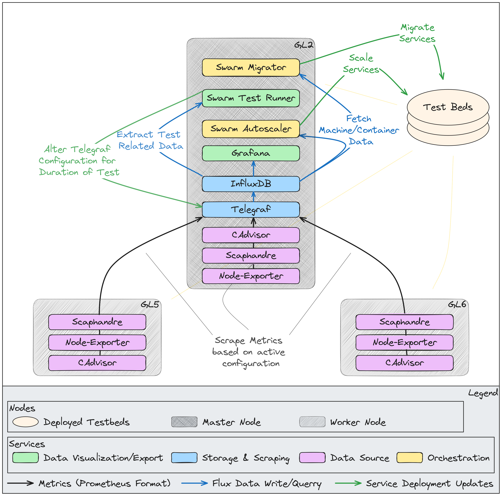

# greenlab-docker-swarm

## Swarm Configuration (GreenLab)

## About
This repository contains the toolkit for gathering, processing and exporting machine metrics with a focus on power consumption.
It also provides services that provide container orchestrating techniques with a focus on energy efficiency optimizations.

Each module contains its own `README.md` where you can find more information about how the modules are implemented as well as usage instructions.

### General
- Containerization Platform: [Docker Swarm](https://docs.docker.com/engine/swarm/)

- Docker Node Active Configuration:
  - GreenLab-STF : Master Node
  - GL2, GL5, MOX2 (Offline) : Worker Nodes